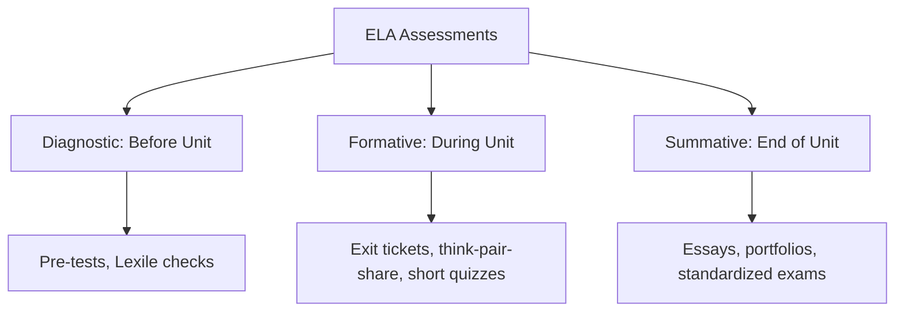

# Designing Balanced Assessments in ELA

[Home](../../README.md) / [Teaching Guides](lesson-planning.md) / ELA Assessments

Assessment should guide instruction. This guide explains how to design diagnostic, formative, and summative assessments for English Language Arts, ESL, and EFL classrooms, integrating digital and AI-supported assessment techniques.

---

## Table of Contents
1. [Types of Assessment](#types-of-assessment)
2. [Formative Assessment (Assessment FOR Learning)](#formative-assessment-assessment-for-learning)
3. [Summative Assessment (Assessment OF Learning)](#summative-assessment-assessment-of-learning)
4. [Diagnostic Assessment (Assessment AS Learning)](#diagnostic-assessment-assessment-as-learning)
5. [AI-Driven Assessment Workflows](#ai-driven-assessment-workflows)
6. [References](#references)

---

## Types of Assessment



---

## Formative Assessment (Assessment FOR Learning)
Formative assessments are quick, low-stakes checks that inform the teacher's next steps.

* **Exit Tickets:** A 2-question digital or paper slip submitted at the end of class.
* **Think-Pair-Share:** Asking a question, giving 1 minute of silent think time, 2 minutes of partner discussion, and sharing out.
* **Fist-to-Five:** Visual self-assessment. Students raise fingers from 1 (do not understand) to 5 (fully understand).

---

## Summative Assessment (Assessment OF Learning)
Summative assessments measure student mastery at the end of an instructional cycle.

* **Analytical Essays:** Structured essays demonstrating citation usage and thesis development.
* **Unit Portfolios:** Collections of draft sheets, revisions, and reflections.
* **Socratic Seminars:** Structured discussions assessing verbal reasoning and text reference skills.

---

## Diagnostic Assessment (Assessment AS Learning)
Used at the start of the year or unit to establish benchmarks.

* **Spelling Inventories:** Testing phonological mastery.
* **Cold Readings:** Unseen reading passages to test pure comprehension and fluency levels.
* **Writing Diagnostic:** A short, unassisted essay to analyze syntax and baseline grammar.

---

## AI-Driven Assessment Workflows

### 1. Generating Exit Tickets (ChatGPT/Gemini Prompt)
* **Prompt:**
  ```text
  Based on the learning standard CCSS.ELA-LITERACY.RL.9-10.3 (analyzing how complex characters develop over the course of a text), generate three distinct exit ticket questions for a Grade 10 English class reading 'The Great Gatsby'. Each exit ticket should take less than 5 minutes to complete and target a different cognitive depth (recall, application, analysis).
  ```

---

## References
* Popham, W. J. (2018). *Assessment Literacy for Educators*.
* Marzano, R. (2006). *Classroom Assessment and Grading That Work*.
